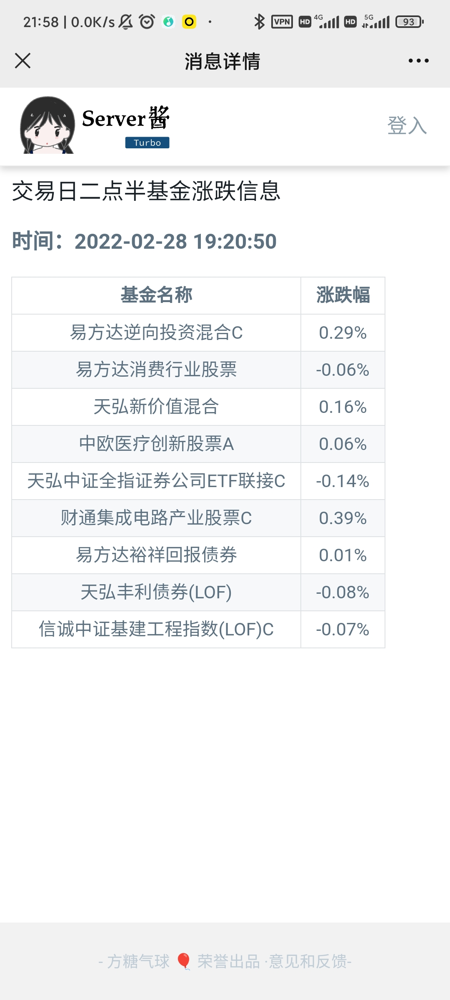
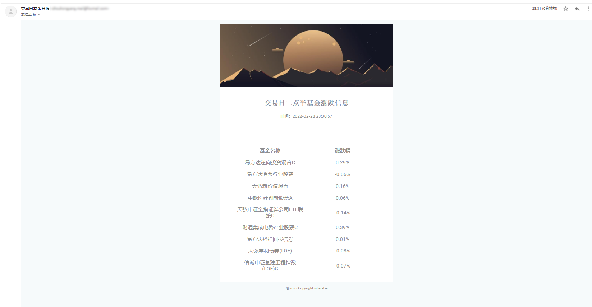
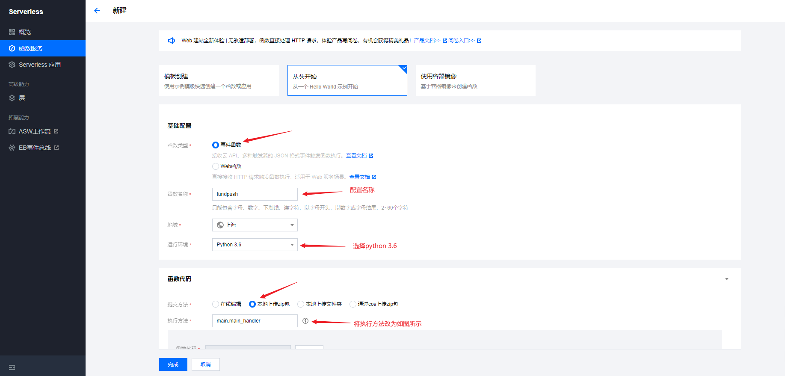

# DayFundPush
交易日基金涨跌幅推送
## Introduction 前言
- 为什么要做这个推送服务？
一般本人会在交易日的两点半看一下当天基金的涨跌情况，然后决定买入或者卖出。但是忙于工作或者其他事情，经常性会忘记，导致错过买入卖出机会，有了这个推送之后，到时间推送，一方面解决了容易忘记的问题，另一方面也让我更容易了解基金的涨跌情况。

## 推送效果
本推送支持邮件和server酱两种形式
- server酱效果

- 邮箱推送效果


## 使用方法
### 服务器使用
推送服务依赖于python，需要服务器具有python环境
1. 下载代码
```git
git clone https://github.com/wherelse/DayFundData.git
```
2. 安装依赖
```shell
cd DayFundInfoPush
pip install -r requirements.txt
```
若安装失败可自行手动安装依赖库
3. 配置信息
配置文件`config.ini`主要包括以下几部分，使用需要进行配置：
- mailconfig 邮箱相关信息的配置
```ini
mailhost = smtp.xx.com
#smtp邮件服务提供商,自行更改
send_address = 
#发件邮箱地址
username = 
#发件人名称，或者昵称，可以为空
password = 
#发件邮箱密码
port     = 465
#发件邮箱端口，采用SSL协议，端口号一般为465
receive_name = 
#收件人名称，或者昵称，可以为空
receive_address =
#收件人邮箱地址 
```
- server酱相关信息的配置
首先需要申请server酱的SENDKEY，官网链接：[server酱](https://sct.ftqq.com/)
```ini
sendkey = 
#server酱推送key
pushchannel = 9
#server酱推送通道
# 方糖服务号=9 Android=98 Bark iOS=8 企业微信群机器人=1 
# 钉钉群机器人=2 飞书群机器人=3 测试号=0 自定义=88 
# PushDeer=18 企业微信应用消息=66
# 支持最多两个通道，多个通道值用竖线|隔开，如 9|98
error_report = true
# 是否通过server酱推送脚本运行错误信息
```

- 提醒相关信息配置
```ini
reminder_path = mail
# 提醒方式，可选邮箱，server酱，或者同时提醒
# serverchan or mail or both
reminder_title = 交易日二点半基金涨跌信息
# 提醒标题
```

- 基金信息配置
```ini
fund_id = 011650,110022,001484 
# 基金代码，多个基金用逗号隔开（注意是英语逗号）
```
配置完成后可以立即运行一次脚本，测试一下配置是否正确。
```shell
python3 main.py
```
4. 设置定时任务
```shell
crontab -e # 进入crontab编辑模式
30 14 * * 1-5 python3 /DayFundInfoPush/main.py 
# 设置每天的下午14点30分执行，具体时间和路径需要自行修改
```
如果需要其他定时执行规律，可以使用生成工具，进行生成。[Crontab生成工具](https://www.toolnb.com/tools/croncreate.html)

### 云函数使用
使用云函数可以不需要服务器，直接在云函数中运行，实现自动推送。
目前腾讯云的云函数免费，下面内容以腾讯云为例，其他云函数可以参考。
1. 下载代码
2. 更改配置文件内容，具体配置方法参考服务器配置过程
3. 打开腾讯云，找到云函数->函数服务->新建

4. 将文件夹中的`main.py,config.ini,template.htm`三个文件使用压缩软件压缩，上传到云函数配置中，然后点击完成。
5. 进入函数触发管理页面，创建触发器，设置触发条件为每天下午14点30分执行。
6. 进入函数管理->函数代码，点击测试，测试是否能够正常运行

## 最后
如果对你有用话，给个star是最大的鼓励，使用中遇到问题请在issue中反馈
感谢小熊提供的基金API:[https://www.doctorxiong.club/](https://www.doctorxiong.club/)
